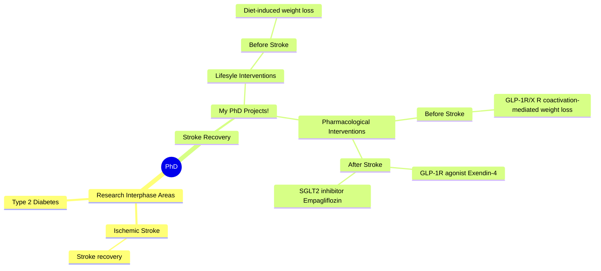

# README.md
Playing with Mermaid

```mermaid
mindmap
  root((PhD))
    Research Interphase Areas
      Ischemic Stroke
        Stroke recovery
      Type 2 Diabetes
    Stroke Recovery
        My PhD Projects!
            Lifesyle Interventions 
                Before Stroke
                    Diet-induced weight loss
                    
            Pharmacological Interventions
                Before Stroke
                    GLP-1R/X R coactivation-mediated weight loss
                After Stroke
                    GLP-1R agonist Exendin-4
                    SGLT2 inhibitor Empagliflozin
            
```
